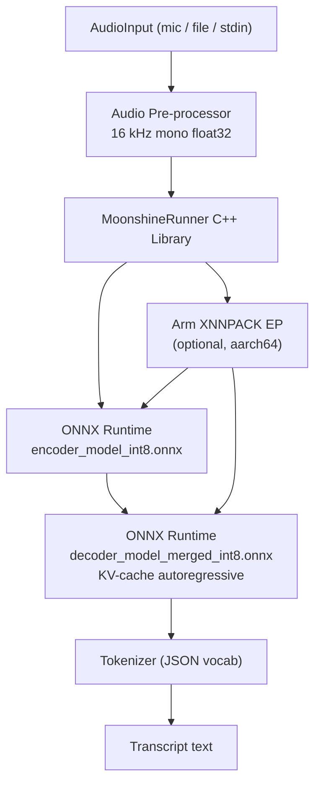

<!--
SPDX-FileCopyrightText: 2024 STT-Runner-Moonshine contributors
SPDX-License-Identifier: Apache-2.0
-->

# STT-Runner-Moonshine

> A CMake-based, cross-platform Speech-to-Text library backed by **[Moonshine](https://github.com/moonshine-ai/moonshine)** (Useful Sensors) via **ONNX Runtime** — designed as a faster, streaming-native alternative to Whisper for edge and mobile deployments.

---

## Why Moonshine instead of Whisper?

| | Whisper Tiny (STT-Runner) | **Moonshine Tiny (this)** |
|---|---|---|
| Model size | ~75 MB | **~27 MB** |
| Compute (10 s clip) | 1× | **0.2×** (5× faster) |
| Padding | 30 s fixed (zero-pad) | **Variable-length** (RoPE) |
| Streaming | ✗ | **✅ (v2 sliding window)** |
| Inference engine | GGML / whisper.cpp | **ONNX Runtime** |
| Arm acceleration | KleidiAI via whisper.cpp | **XNNPACK / ACL via ORT** |

---

## Quick Start

### Prerequisites

- CMake 3.27+
- C++17 compiler
- Python 3.9+ (for model download / Python binding)
- `ninja` (recommended)

### 1. Get the models

```bash
pip install huggingface-hub onnxruntime
python scripts/export_onnx.py --model tiny
# → models/moonshine-tiny/
```

### 2. Build (native)

```bash
cmake -B build/native --preset=native
cmake --build build/native
```

### 3. Transcribe a file

```bash
export MOONSHINE_MODEL_DIR=$PWD/models/moonshine-tiny
./build/native/transcribe --rtf audio.wav
```

### 4. Live mic transcription (stdin pipe — no extra deps)

```bash
arecord -r 16000 -c 1 -f FLOAT_LE -q | ./build/native/live
```

Or with PortAudio (rebuild with `--preset=native-portaudio`):

```bash
cmake -B build/native-portaudio --preset=native-portaudio
cmake --build build/native-portaudio
./build/native-portaudio/live
```

### 5. Python binding (no C++ needed)

```bash
pip install onnxruntime soundfile
python bindings/python/moonshine_runner.py --rtf audio.wav
```

---

## Architecture



---

## Supported Platforms

| CMake preset | Host | Target | Notes |
|---|---|---|---|
| `native` | Linux x86_64 / aarch64 / macOS | same | Dev & test |
| `native-portaudio` | any | same | Live mic via PortAudio |
| `x-linux-aarch64` | Linux x86_64 | Linux aarch64 | Arm XNNPACK ON |
| `x-android-aarch64` | Linux / macOS | Android arm64-v8a | NDK required |

---

## Repository Structure

```
STT-runner-moonshine/
├── CMakeLists.txt
├── CMakePresets.json
├── cmake/
│   ├── FetchMoonshineModels.cmake
│   └── toolchains/aarch64-linux-gnu.cmake
├── include/moonshine_runner/
│   ├── runner.hpp          ← Public API
│   └── audio_utils.hpp
├── src/
│   ├── runner.cpp          ← ORT inference pipeline
│   ├── audio_utils.cpp
│   ├── tokenizer.hpp       ← Internal JSON tokenizer
│   └── tokenizer.cpp
├── app/
│   ├── transcribe.cpp      ← CLI: file transcription
│   └── live.cpp            ← CLI: live streaming
├── benchmark/bench.cpp     ← RTF / TTFT benchmark
├── bindings/
│   ├── python/moonshine_runner.py   ← Pure-Python ORT binding
│   └── java/MoonshineRunner.java    ← JNI for Android
├── tests/
├── scripts/export_onnx.py  ← Model download + INT8 quantize
└── models/                 ← Downloaded at configure time (gitignored)
```

---

## Build Options

| CMake option | Default | Description |
|---|---|---|
| `BUILD_EXECUTABLE` | ON | Build `transcribe` and `live` CLIs |
| `BUILD_BENCHMARK` | ON | Build `bench` executable |
| `BUILD_TESTS` | ON | Build unit/integration tests |
| `MOONSHINE_ARM_BACKEND` | OFF | Enable Arm XNNPACK EP |
| `MOONSHINE_USE_PORTAUDIO` | OFF | Enable PortAudio for `live` |
| `MOONSHINE_FETCH_MODELS` | ON | Auto-download models at configure |
| `MOONSHINE_MODEL_SIZE` | tiny | `tiny` or `base` |

---

## License

Apache-2.0 — see [LICENSE](LICENSE).

Moonshine models: MIT License (Useful Sensors / moonshine-ai).
ONNX Runtime: MIT License (Microsoft).
